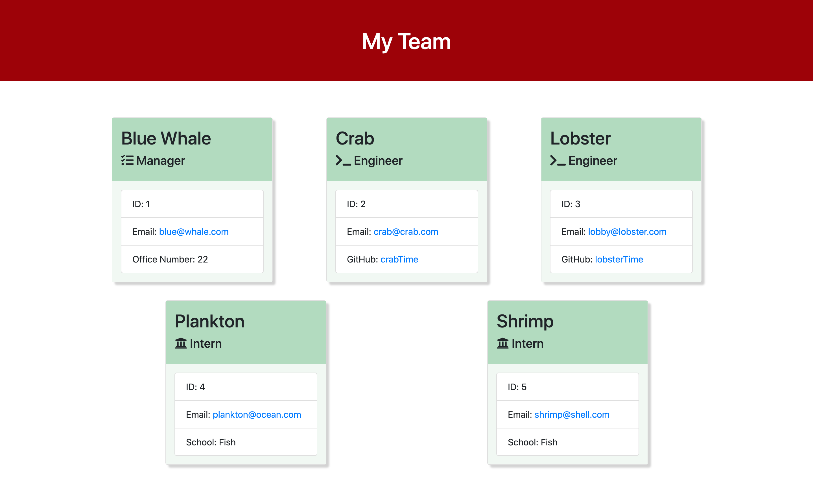

# Team Profile Builder

  ## Table of Contents
  * [Description](#description)
  * [Technologies](#technologies)
  * [Installation](#installation)
  * [Usage](#usage)
  * [Sample HTML](#sample-html)
  * [Video Demonstration](#video-demonstration)
  * [Contributing](#contributing)
  * [Test](#test)
  * [Questions](#questions)

  ## License 
This project is covered under the MIT License.
    
  
  
  - Click on the badge to see **MIT License** details.

  ## Description
  - Command line interface application that builds an html page based on user input. 
  - Generates a card for each employee entered.

  

  ## Technologies
  - Node.js
  - NPM
  - Inquirer(npm package)
  - JavaScript
  - Jest.js
  - Bootstrap
  - CSS
  - HTML

  ## Installation
  Use the command "npm install" to install any dependencies. To invoke the application, use "node index.js".

  ## Usage
  This application is used to quickly generate organized information about your employees.  Can be used on your website.

  ## Sample HTML
  - Link to sample [HTML](./sample-html/sample.html)

  ## Video Demonstration
  - Link to video [demonstration](https://drive.google.com/file/d/1WSDoDDO9amxrrG1w1Z0iYHQwGL8o3Vp5/view?usp=sharing)

  ## Contributing
  Let me know if you have any suggestions on improvement, and how you would like to contribute.

  ## Test
  Testing is used through Jest.js.  In order to run the tests, use the command "npm run test".

  ## Questions
  
  [github.com/jeffMullen](https://github.com/jeffMullen)

  If you have additional questions, feel free to reach me at jeffmullendev@gmail.com
